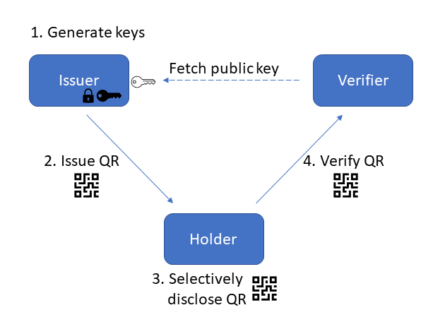

# Claim QR Codes

It is useful for users to be able to present attribute information, or _claims_ about themselves to various relying parties. This commonly happens in online exchanges, through federated protocols such as OpenID Connect. The situation is quite different in the real-world, where the claims are typically encoded in physical documents (e.g., drivers license, employment badges, etc.) in which various measures are employed to protect the integrity of the document and to attest to their origin.

The advent of COVID vaccination credentials popularized the idea of carrying electronically-protected claims while presenting them in an offline manner, typically using a QR code. One such popular effort is the [SMART Health Cards](https://smarthealth.cards/) (SHC) framework that enabled milions of people to hold their proof of vaccincation in a QR image or a paper printout.

This paradigm of showing electronically protected claims using a QR code is an interesting one. The ubiuquity of smartphones allowing users to hold their claims in a client wallet, and verifiers to easily scan the QR codes for validation, makes it very easy to interact in a user-centric, ad hoc manner.

The goal of this project is to prototype how generic claims (attributes) can be issued to users in the form of a QR code that can be presented to verifiers, who can dynamically discover the issuer and validate the claims. In this initial release, we are reusing most of the technical decisions of the SHC framework (wrt encoding, etc.); alternative options will be explored in future versions.

## System overview



## Differences with the SHC framework

SHCs are meant to encode medical data, using the [FHIR](https://www.hl7.org/fhir/) standard. General claims can be encoded using [JSON Web Tokens](https://datatracker.ietf.org/doc/html/rfc7519) (JWT). The main differences with the SHC framework are:

* No VC: for simplicity, the claims are encoded directly in a JWT, and not in a Verifiable Credential object. In SHC framework, the VC property simply acts like a shell for the FHIR bundle, so removing it helps removing a dependency.
* No chunking: +++
* No X.509: +++
* cqr header vs shc: +++

## Extensions

* More sig alg
* Different compression

## Glossary

* JWT: JSON Web Tokens, see [RFC 7519](https://datatracker.ietf.org/doc/html/rfc7519)
* JWS: JSON Web Signature, see +++
* JWK: JSON Web Key, see +++
* JWKS: JSON Web Key Set, a set of JWK, see section +++ of +++

## Example

### Generate the issuer keys

The issuer, identified by its URL `[ISSUER_URL]`, first needs to create its key pair. The resulting JSON Web Key Set (JWKS) file must be hosted at `[ISSUER_URL]/.well-known/jwks.json`, while the private key must be kept secret.

#### Command-line

Using the `npm` command-line:

```
npm run generate-issuer-keys -- --jwksPath jwks.json --privatePath privatekey.json
```

The public key will be added to the JWKS file specified by  `jwksPath` (will be created if it doesn't exist). 

#### API

+++

### Issuer a Claim QR

The issuer can create a QR code from a JSON Web Token (JWT) containing an `iss` property with the value `[ISSUER_URL]` and a set of application-specific claims, using its private key.

#### Command-line

Using the `npm` command-line:

```
npm run issue-qr -- --privatePath privatekey.json --jwtPath jwt.json --qrPath qr.png
```

The resulting QR code image `qr.png` can be used by the user.

#### API

+++


### Verify a Claim QR

Any party can verify a presented QR code, and extract the encoded JWT. The issuer's public key will be retrieved from the `iss` property in the encoded JWT; optionally, a JWKS can be passed to the verifier for offline validation.

#### Command-line

Using the `npm` command-line:

```
npm run verify-qr -- --qrPath qr.png --jwtPath outjwt.json [--jwksPath <jwksPath>]
```

#### API

+++

## Sample

The `sample/` folder contains a sample issuer and verifier that can be used to issue and verify a Claim QR.

To setup and deploy the sample, perform the following steps:
```
cd sample
npm install
npm run build
npm run deploy
```

## Contributing

This project welcomes contributions and suggestions.  Most contributions require you to agree to a
Contributor License Agreement (CLA) declaring that you have the right to, and actually do, grant us
the rights to use your contribution. For details, visit https://cla.opensource.microsoft.com.

When you submit a pull request, a CLA bot will automatically determine whether you need to provide
a CLA and decorate the PR appropriately (e.g., status check, comment). Simply follow the instructions
provided by the bot. You will only need to do this once across all repos using our CLA.

This project has adopted the [Microsoft Open Source Code of Conduct](https://opensource.microsoft.com/codeofconduct/).
For more information see the [Code of Conduct FAQ](https://opensource.microsoft.com/codeofconduct/faq/) or
contact [opencode@microsoft.com](mailto:opencode@microsoft.com) with any additional questions or comments.

## Trademarks

This project may contain trademarks or logos for projects, products, or services. Authorized use of Microsoft 
trademarks or logos is subject to and must follow 
[Microsoft's Trademark & Brand Guidelines](https://www.microsoft.com/en-us/legal/intellectualproperty/trademarks/usage/general).
Use of Microsoft trademarks or logos in modified versions of this project must not cause confusion or imply Microsoft sponsorship.
Any use of third-party trademarks or logos are subject to those third-party's policies.
